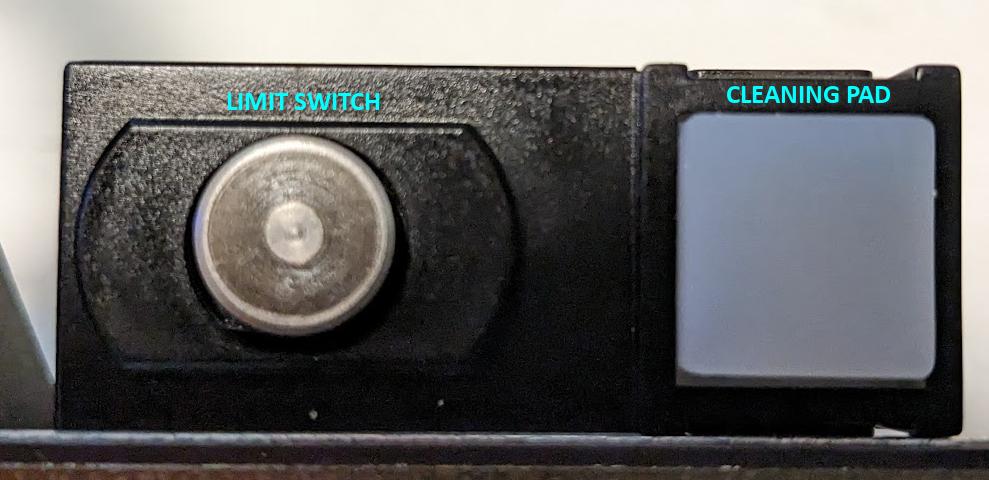
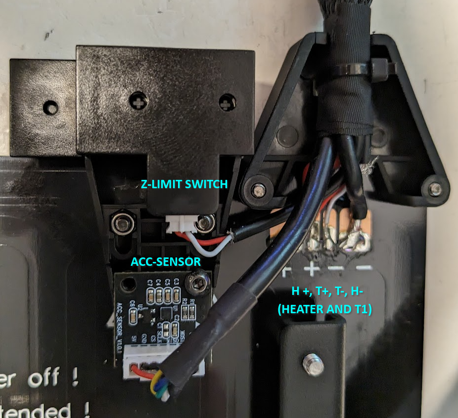
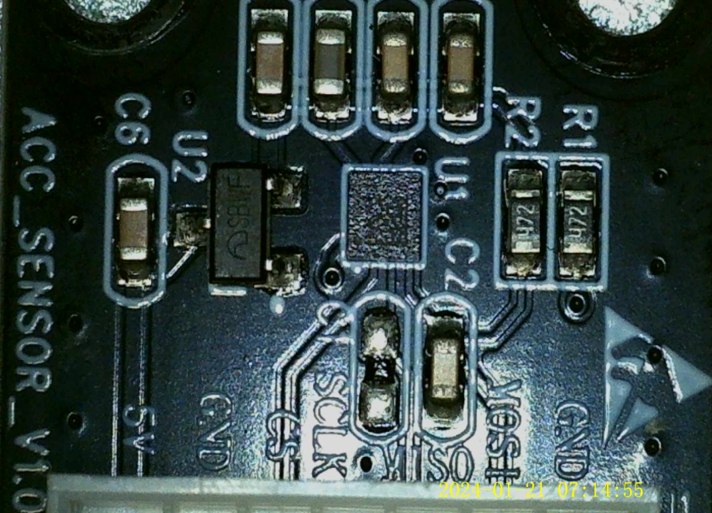

# The bed

Well, not the heating bed itself, which seems quite standard, but the sensors there.

# The "enhanced levi-Q 2.0"
I've done some measurings and is simply a very sensitive switch. We can probably treat it as a Z-limit switch after putting the head in the right position.
The pad next to it is a silicone pad to clean the head before testing the switch.

# Pinout

As the pinout is quite straightforward, I won't do the fancy SVG.
* Bed and T1 are soldered directly to the board
* Z-limit goes to CALIBRATION in motherboard. JST-ZHR2
* ACC-SENSOR goes to the connector of the same name in motherboard. JST-ZHR7

# The accelerometer

The board contains a [LIS2DW12](lis2dw12.pdf) accelerometer; same model as in the header.
