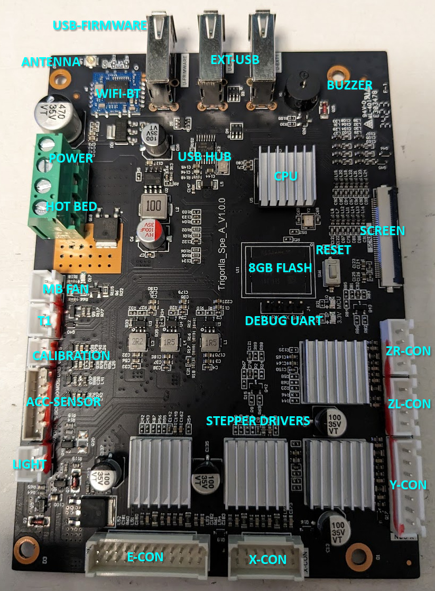
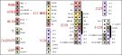

# The motherboard

## Overview
Anicubic has replaced their standard marlin-compatible boards with a new system buit around the Allwinner R528, which seems very similar in characteristics to the T113-S3. While is not a custom processor, it is either very new or not really popular. It was originally designed for (i think) car dashboard appliances. It has hardware accellerated video decoding (plus accelerated MJPEG encoding for the dashboard cams), and comes with 128Mib of on-package ram, plus up to 6 UARTS (to talk to the stepper drivers) and 2 SPI (to talk to the sensors) plus an LVDS interface (to directly drive an LCD screen).

Allwinner usually doesn't support Linux out of the board, so it runs a port of OpenWRT that is loaded over a base Android Kernel (or something like this, I'm not a Linux expert), a bit like how Linux is loaded on some phones. This distro is called **Tina Linux**,

There's also a BL-M8723DU1 board (or very similar) Wifi/BT chip based on the RTL8723DU chipset that is connected to the USB interface.

The motherboard doesn't feature any SD card reader, but includes 8GB of flash memory for storing the OS and prints, and can copy files from USB drives or via the Wifi interface by either using the Anycubic app (please don't), or by using [kenguru's Kobra Unleashed](https://github.com/anjomro/kobra-unleashed).

For driving the axis, the motherboard has four TMC2209 stepper drivers soldered directly. It communicates with them via UART.

And fortunately for us, it has a soldered Debug header with clearly labeled pinout so we can work our way out of this mess.

### Some more notes
* USB-FIRMWARE is connected directly to the processor's USB-DRD port, and can be set to behave as USB PERIPHERAL at boot time.
* USB-EXT (1 and 2) are connected to the processor via an USB Hub, and can only be used in USB HOST mode. As there is only one USB-DRD and one USB-HOST port in the processor, I think the Wifi is also connected to the hub.

## Pinout
(LVDS is ommited. According to [Boris' diagram in the Klipper thread](./boris-assumed-internal-architecture.png), is a 30 pin LVDS + a 4-wire resistive touch interface)

Connectors are as follows
* POWER and HOTBED use straight power cables (tipped)
* MB-FAN, T1, and LIGHT use PHR-2
* CALIBRATION uses a JST ZHR2
* ACC-SENSOR uses a JST ZHR7
* ZL and ZR use JST PHR-4
* Y-CON uses JST PHR-7
* X-CON and E-CON use (I think) JVT "PHB" connectors (JVT2041HNO-14 and JVT2041HNO-24 respectively)

## Other relevant data
* [Allwinner R528 datasheet](r528_user_manual_v1.3.pdf)
* [BL-M8723D1 datasheet](BL-M8723DU1-datasheet.pdf)
* [JVT-PHB housing datasheet](JVT-PHB2.pdf)
* [JVT-PHB connector datasheet](JVT-PHB.pdf)
