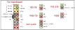
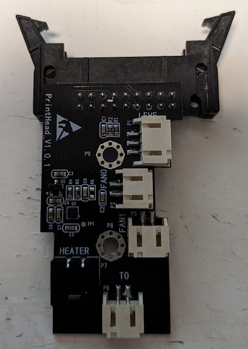

# The printhead

(If you want nice photos of the printhead, [Kobra pro 2 insights prinhead page](https://1coderookie.github.io/Kobra2ProInsights/hardware/printhead/) has a lot!)

The new printhead is used in the Kobra 2 Pro, Plus and Max, and contains the following inside:
* A 6-wire stepper (center taps not connected to motherboard). Model is marked as **42SHDB0066Z-10WD** connected to a direct drive system.
* A 100k NTC Thermistor.
* A 24V 60W heater cartridge
* An anycubic custom heater block. Is styled as a volcano, but is not compatible. There's a 40mm PTFE tube for the heatbreak, and comes with a silicone sock.
* The heatsink fan is a 24V 30x30x10 axial fan. Model marked as **HSC BCY3010D24H**
* The part cooling fan is a 24V 50x50x20 centrifugal fan. Model is marked as **COOLCOX BF5020H24D**
* An induction sensor for automatic bed leveling. According to 1coderookie, is a PNP-NO type, similar if not the same as the ones used in previous Kobra models.
* A distribution board that also contains an accelerometer. Is the same accelerometer that the bed uses and judging from the pinout seems to be a LIS2DW12.

## Pinouts

Connectors are as follows:
* Motherboard is a 2 row x 9 pin molex, 2,54mm spacing.
* T0, FAN0 and FAN1 are JST PH connectors, 2 pins.
* LEVE is a JST PH connector, 3 pins.
* HEATER is a Molex Micro-Fit connector, 2 pins.

## Extra images

